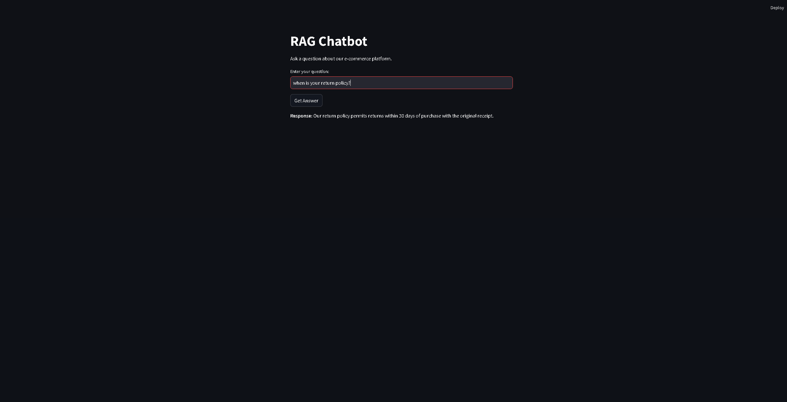

# RAG Chatbot

This is a Retrieval-Augmented Generation (RAG) chatbot that leverages OpenAI's ChatGPT API to answer questions with the help of a knowledge base. The knowledge base is powered by vectorized embeddings, allowing for highly relevant and accurate responses.



## Features
- Intelligent dialogue system using ChatGPT API
- Retrieval-Augmented Generation (RAG) architecture
- Vectorized FAQ database for accurate answer retrieval
- Simple user interface built with Streamlit

## Project Structure
RAG_Chatbot_Project/
├── data/                   # Folder for raw documents or text data
├── embeddings/             # Folder to store vectorized embeddings (optional)
├── models/                 # Folder to save any model files if needed
├── src/                    # Backend logic files
│   ├── __init__.py
│   ├── data_processing.py  # Document preprocessing
│   ├── vector_store.py     # Vectorizing and storing documents
│   ├── query_handler.py    # Query processing with ChatGPT
│   └── prompt_utils.py     # Prompt engineering
├── frontend/               # Frontend code
│   └── app.py              # Streamlit app for the chatbot frontend
├── requirements.txt        # Dependencies for the project
└── README.md               # Documentation for the project


## Installation

1. **Clone the repository**:
   ```bash
   git clone https://github.com/Mettice/RAG_Chatbot.git
   cd RAG_Chatbot


Create a virtual environment:

python -m venv env
source env/bin/activate  # On Windows: env\Scripts\activate


Install dependencies:

pip install -r requirements.txt

Set up the OpenAI API key:

Create an environment variable named OPENAI_API_KEY with your OpenAI API key.

Usage

Run the Streamlit App:

streamlit run frontend/app.py

Enter questions in the UI and get responses generated by the chatbot.

Deployment
This project can be deployed on Streamlit Cloud. Follow the deployment instructions provided in the documentation for setup.

License
This project is licensed under the MIT License.
